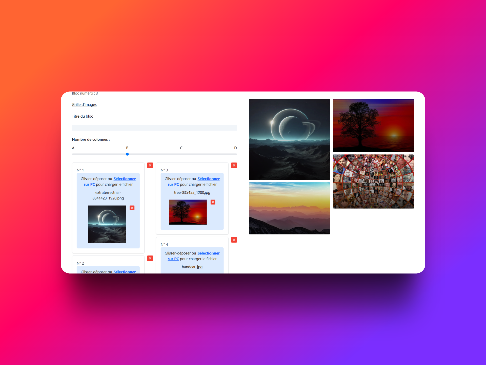
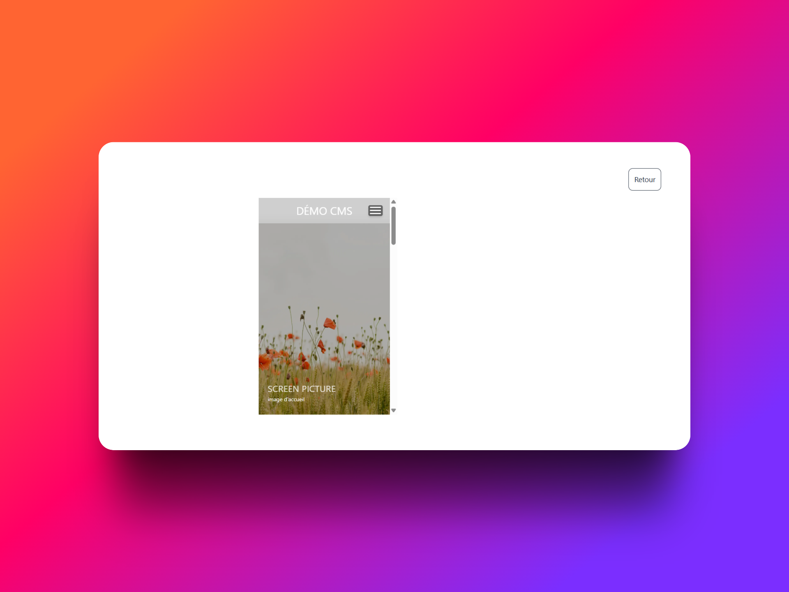
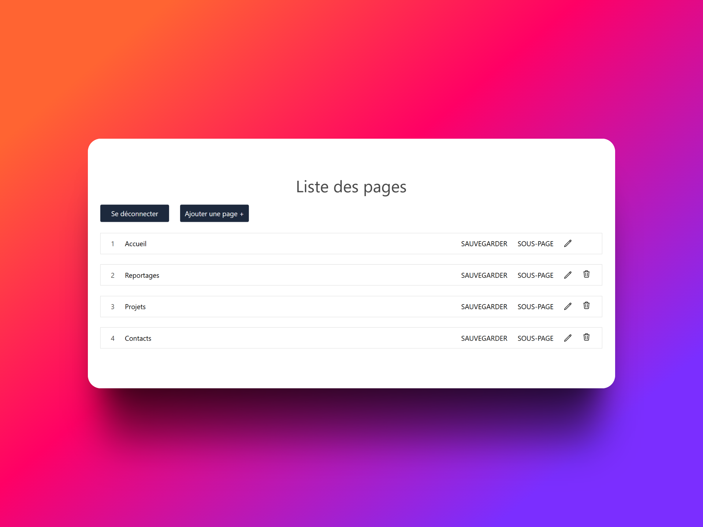

# 

This repository contains a CMS for building static websites.

When you build a page, you see directly what you create :

One click and you seen full page result
Two clicks and you see responsive mode

- creating pages fully customizable (create, delete modify, change page position)

- creating subpages.

Only first level pages appear in burger menu.
Sublevel pages can be chosen as redirections towards other pages within the website.
Parent page can access direct sublevel pages. This allows you to organize your pages.
If you click on the pen you can access page edition.

Let's say you want to edit a projects page, you will land on your previously created page.

## You get your two block header and footer which you can edit from all your pages.

- creating blocs :

For the moment 5 customizable blocks are available :

- a screen block that allows you to display a picture full width if the block is in first position or just a big picture that takes container width. You can add a title and a quotation underneath.
- a carousel
- a text block in which you can add a picture that you can position on top of the text, on the right or left of the text. You can also add a title to this block
- a grid picture block. Pictures are clickable and become bigger.
- a rediction block made of cards. You can redirect to an inner subpage block or an external url. You have to write https:// in front of the url if you want it to redirect to external site.

# 

Ce dépôt contient un CMS permettant de créer des sites web statiques.

Lorsque vous construisez une page, vous voyez immédiatement ce que vous créez :

  
  

Un clic pour voir le rendu de la page complète  
Deux clics pour passer en mode responsive

  

- création de pages entièrement personnalisables (créer, supprimer, modifier, changer la position de la page)

- création de sous-pages.

Seules les pages de premier niveau apparaissent dans le menu burger.  
Les sous-pages peuvent être utilisées comme redirections vers d'autres pages du site.  
La page parente peut accéder directement à ses sous-pages. Cela vous permet d’organiser la structure de votre site.  
En cliquant sur le stylo, vous accédez à l’édition de la page.

Par exemple, si vous souhaitez éditer une page "projets", vous serez redirigé vers cette page précédemment créée.

- création de blocs :

Actuellement, 5 blocs personnalisables sont disponibles :

- un bloc "écran" qui permet d'afficher une image en pleine largeur si le bloc est en première position, ou une grande image qui prend toute la largeur du conteneur. Vous pouvez y ajouter un titre et une citation en dessous.
- un carrousel
- un bloc texte dans lequel vous pouvez ajouter une image positionnée au-dessus du texte, à droite ou à gauche. Vous pouvez également ajouter un titre à ce bloc
- un bloc grille d'images. Les images sont cliquables et s’agrandissent
- un bloc de redirection composé de cartes. Vous pouvez rediriger vers une sous-page interne ou une URL externe.  
  **Attention :** vous devez inclure `https://` devant l’URL pour une redirection externe.

## Coming soon :

- new blocks
- translation system
- color palette

## Bientôt disponible :

- nouveaux blocks
- systeme de traduction
- palette de couleur

## Local use :

NEXT_PUBLIC_VITE_REACT_APP_BACKEND_URL = "http://localhost:80/your_repo_name"

DB_HOST = "localhost"

DB_USER = "XXXXXXX"

DB_PASSWORD = "XXXXXX"

DB_NAME = "XXXXXX"

ALLOWED_ORIGIN = "http://localhost:3000"

NEXT_SECRET="XXXXXX"

NEXT_HOST="XXXXX"
